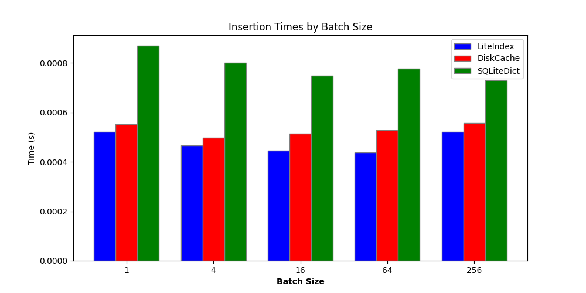

### Comparing liteindex, diskcache, sqlitedict

#### Random data insertion

- [`random_data_generator.py`](./random_data_generator.py) - generates numbers, strings, bytes, numpy arrays or lists and dicts of them
- [`random_data_insertion.py`](./random_data_insertion.py) - inserts the generated data into the three libraries and benchmarks
- 10000 items randomly generated and added to each Index in batches of 1, 4, 16, 64, 256
- So a totalof 50000 items are added to each Index
- A batch is inserting a list of items at once, instead of one by one

***Table of on-disk sizes after insertion of 50000 items***

| Index | Size (MB) |
| --- | --- |
| liteindex | 1862.2 |
| diskcache | 1924.7 |
| sqlitedict | 1940.4 |

*** Table of insertion times per record, averaged (in milli seconds)***
| Batch of: | 1 | 4 | 16 | 64 | 256 |
| --- | --- | --- | --- | --- | --- |
| liteindex | 0.522 | 0.466 | 0.445 | 0.439 | 0.520 |
| diskcache | 0.74 | 0.61 | 0.646 | 0.619 | 0.611 |
| sqlitedict | 1.1 | 1.06 | 1.04 | 0.996 | 0.942 |

*** Table of read times per record, averaged (in milli seconds)***

| Batch of: | 1 | 4 | 16 | 64 | 256 |
| --- | --- | --- | --- | --- | --- |

*** Table of pop times per record, averaged (in milli seconds)***
| Batch of: | 1 | 4 | 16 | 64 | 256 |
| --- | --- | --- | --- | --- | --- |

